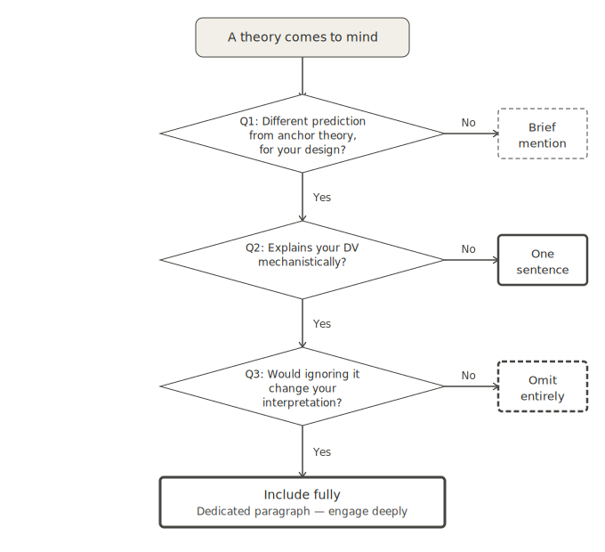

# Two Filters, Three Outcomes

::: {.callout-note icon="false"}
## In a nutshell

- Perceived relevance of a theory is not the same as argumentative necessity
- Two filters determine how much work a theory does in your argument
- The result is one of three levels of treatment — and only one leads to strong inference
:::

Once you have your anchor theory, you will inevitably encounter other theories that feel relevant. Some of them are. Most of them are not — at least not for this paper.

The problem is that relevance is a spectrum, and "loosely related to the phenomenon I am studying" is not the same as "necessary for the argument I am making." In a theory-rich field, almost any theory can be made to sound relevant with a sentence or two of framing. That is precisely the trap.

The two filters below force a more honest question: does this theory do any work in this paper? Not in the field generally. Not in a review article. In this paper, with this design, for this argument.

Apply them sequentially. A theory that fails the first filter does not need to be assessed against the second.

## Filter 1 (2): Does it make a different prediction from your anchor?

Not whether the theory addresses the same phenomenon — it almost certainly does, or you would not be considering it. The question is whether it predicts something *different* from your anchor, given your specific manipulation and dependent variable.

Two theories can address the same phenomenon at the field level while making identical predictions for your specific operationalization. Specificity of design is what creates the wedge — or reveals that there is none. A theory that makes no distinct prediction for your study is not a competitor. The reader should know it exists — hence the citation — but it has earned nothing more.

If the answer is **no** — citation only.

If the answer is **yes** — proceed to Filter 2.

## Filter 2 (F2): Does it reach your dependent variable mechanistically?

A theory can make different predictions in principle and still not connect to your specific measure. If the theory addresses the phenomenon at a level of description that does not reach your DV, it cannot be tested by your study — and a theory that cannot be tested by your study is not a live competitor in your argument.

Mentioning it briefly is the honest move: tell the reader the theory exists, that it addresses the phenomenon, and why your study does not test it.

If the answer is **no** — mention it and explain why it is not tested here.

If the answer is **yes** — you are in the territory of strong inference [@platt1964]. Both theories earn full treatment. Your introduction sets up the competition explicitly. Your results deliver the verdict. Your discussion addresses what the outcome means for both accounts — including the one that lost.

The two filters produce three possible outcomes:

| Outcome             | Treatment                             |
|---------------------|---------------------------------------|
| Fails F1            | Citation only                         |
| Passes F1, fails F2 | Mention + explain why not tested here |
| Passes both         | Full treatment — strong inference     |

{width="100%"}

::: {.callout-tip icon="false"}
## Worked example: event cognition

The anchor theory in both designs below is Event Segmentation Theory (EST; @zacks2007). EST holds that people continuously predict what will happen next based on an event model held in working memory. When prediction error rises, a boundary is perceived and the event model is updated.

------------------------------------------------------------------------

### Design A: Boundary detection latency

Participants watch short video clips in which the perceptual predictability of event boundaries is manipulated. The dependent variable is boundary detection latency — how quickly participants press a button when they perceive a boundary.

**SPECT** [@loschky2020]

SPECT integrates front-end perceptual processes — attentional selection and information extraction during fixations — with back-end event model construction. For a design manipulating perceptual predictability with detection latency as DV, SPECT and EST make the same prediction: detection is driven by mismatches between incoming perceptual input and the current event model. There is no distinct prediction. *Fails F1.* → Citation only.

**Event-Indexing Model** [@zwaan1995; @zwaan1998]

The Event-Indexing Model proposes that boundaries are perceived when discontinuities occur along situational dimensions — time, location, character, intention, and causation. EST attributes boundaries to perceptual prediction error; the Event-Indexing Model attributes them to dimensional discontinuity. In a design manipulating perceptual predictability, these can come apart: a boundary can involve high prediction error without a dimensional discontinuity, and vice versa. *Passes F1.*

The Event-Indexing Model specifies when situation model updating occurs, not how quickly. It makes no prediction about detection latency as a function of predictability. *Fails F2.* → Mention + explain why not tested here.

**Structure Building Framework** [@gernsbacher1990]

The Structure Building Framework predicts that boundaries arise from coherence breaks — points at which incoming information is sufficiently discrepant to trigger a shift to a new substructure. EST emphasizes perceptual prediction error; the Structure Building Framework emphasizes semantic coherence. These can come apart: a scene can involve high perceptual change without a coherence break, and vice versa. *Passes F1.*

The framework specifies what triggers a substructure shift, not how quickly one is detected. It makes no prediction about the temporal dynamics of boundary perception, and therefore does not reach detection latency as a dependent variable. *Fails F2.* → Mention + explain why not tested here.

#### How the filters apply in Design A

| Theory                       | F1  | F2  | Treatment         |
|------------------------------|-----|-----|-------------------|
| SPECT                        | ✗   | —   | Citation only     |
| Event-Indexing Model         | ✓   | ✗   | Mention + explain |
| Structure Building Framework | ✓   | ✗   | Mention + explain |

No competing theory earns full treatment in this design. That is not a failure of scholarship — it accurately reflects what each candidate theory contributes to this specific argument.

------------------------------------------------------------------------

### Design B: Memory and prediction across dimension changes

Participants watch the same video clips, but now the number of situational dimension changes at event boundaries is manipulated — from one dimension changing to four. The dependent variables are recognition memory for boundary frames and prediction accuracy for events following the boundary.

**Event-Indexing Model**

EST and the Event-Indexing Model now make opposite predictions. EST holds that event model updating is global: the model is reset at every boundary regardless of how many dimensions change, so memory and prediction performance should be flat across conditions. The Event-Indexing Model holds that updating is incremental: only the dimensions that change are updated, so more dimension changes mean more updating effort. Memory performance should increase linearly with the number of dimension changes; prediction accuracy should decrease linearly.

Both theories address recognition memory and prediction accuracy directly and mechanistically. EST's gating mechanism predicts deeper encoding at boundaries; the Event-Indexing Model's additivity hypothesis predicts linear scaling with the number of dimension changes. Both theories reach both dependent variables. *Passes F1 and F2.*

→ **Strong inference.** The introduction sets up the competition between global and incremental updating. The results report whether the pattern across dimension-change conditions is flat or linear. The discussion addresses what the outcome means for both theories.

#### How the filters apply in Design B

| Theory                       | F1  | F2  | Treatment                         |
|------------------------------|-----|-----|-----------------------------------|
| SPECT                        | ✗   | —   | Citation only                     |
| Event-Indexing Model         | ✓   | ✓   | Full treatment — strong inference |
| Structure Building Framework | ✓   | ✗   | Mention + explain                 |

The same anchor, the same candidates, two different designs — and a fundamentally different argumentative structure. In Design A, the Event-Indexing Model earns a brief mention. In Design B, it earns equal billing. What changes is not the field, not the theories, but the design.
:::

The next chapter addresses how to write the theoretical framing once you know which theories belong and at what level.
