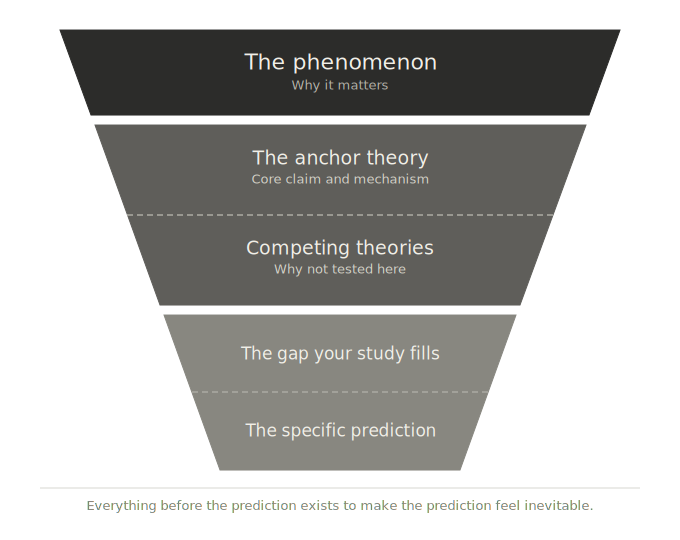

# Writing the Theoretical Framing

::: {.callout-note icon="false"}
## In a nutshell

- The funnel moves from phenomenon to anchor theory to specific prediction — in that order, at that level of detail
- Each paragraph has exactly one job; state that job before you write the paragraph
- Five paragraph jobs cover a complete theoretical framing; a sixth is a signal to go back to the filters
:::

You have your anchor theory. You have run every other candidate through the two filters. You know what belongs in your paper and what does not. Now you have to write it.

A colleague once described writing as debugging your thinking. You believe the logic is clear until you try to put it into sentences, and then you discover the gaps. The funnel structure and the paragraph rule give the debugging process a shape.

## The funnel structure

A well-written theoretical framing moves from broad to narrow — from the phenomenon to the specific prediction. The reader needs to be oriented before they are asked to follow an argument.

{width=100%}

The funnel has three levels.

**The phenomenon.** One or two sentences establishing what you are studying and why it matters. This is not a literature review. It is an orientation. The reader should finish these sentences knowing what the paper is about.

**The anchor theory.** A concise statement of the theoretical account that drives your hypotheses. What does the theory claim? What mechanism does it propose? What does it predict in general? Keep this tight — two to four sentences at most. You are not writing a review of the theory; you are establishing the lens through which your results will be interpreted.

**The specific prediction.** The narrowest point of the funnel. Given your anchor theory and your specific design, what do you predict and why? This is the payoff of the entire theoretical framing. Everything before it exists to make this prediction feel inevitable.

Competing theories and the gap your study fills belong inside the funnel — not as additions to it. They are part of making the prediction feel inevitable. A prediction that arrives without context feels asserted rather than argued. The paragraph jobs below show where each element sits.

## One paragraph, one job

Each level of the funnel corresponds to a small number of paragraph jobs. Each paragraph should have exactly one of them. State that job in a single sentence before you write the paragraph. If you cannot state it, you are not ready to write the paragraph.

| Funnel level | Paragraph job |
|---|---|
| Phenomenon | Establish why the phenomenon matters |
| Anchor theory | Introduce the anchor theory and its core claim |
| Anchor theory | Acknowledge competing theories and explain why your study does not test them |
| Specific prediction | State the gap your study fills |
| Specific prediction | State the specific prediction that follows from the anchor theory for your study |

Five jobs. A sixth paragraph means either a job has been split across paragraphs unnecessarily, or a paragraph has been added that the funnel does not require. In either case, go back to the filters and ask whether the additional paragraph is doing argumentative work or just adding coverage.

The most common structural mistake is the omnibus paragraph — a single paragraph that introduces a theory, summarises its history, notes its limitations, compares it to alternatives, and mentions your study without connecting it to the argument. The reader finishes it without knowing what to think. One job per paragraph prevents this.

The next chapter gives you three tests to apply once you have a draft.