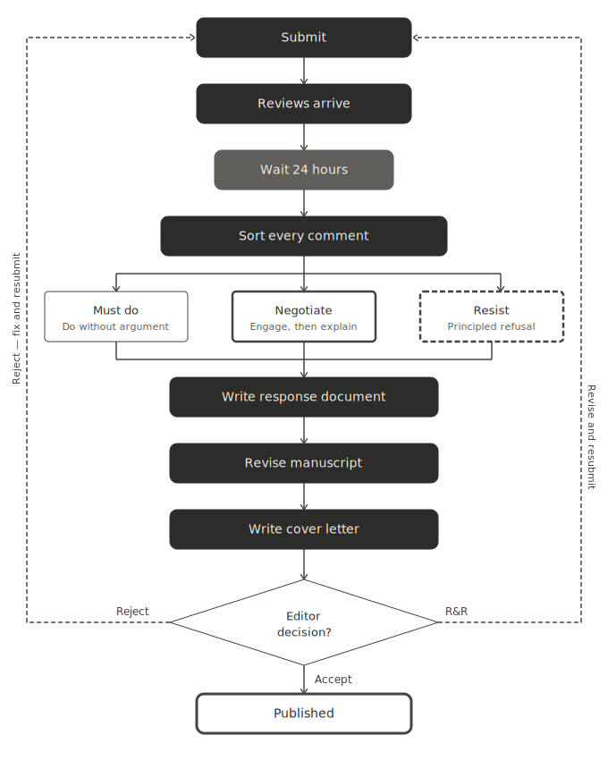

# The Revision Process

::: {.callout-note icon="false"}
## In a nutshell

- Sort every reviewer comment into must do, negotiate, or resist before writing a single word of your response
- The cover letter signals to the editor that you have done the work; the response document is a formal record of every comment and every change
- Open the submitted file, save a copy, and enable track changes before touching anything
:::

Getting reviews back is one of the most disorienting experiences in academic life. Even positive reviews require substantial work, and negative ones can feel like a personal attack on months or years of effort. This chapter is about the practical mechanics of turning a reviewed manuscript into an accepted one, with particular attention to the revision decisions that involve theoretical framing, which are consistently the most consequential and the hardest to get right.

{width="100%"}

## Before you write anything: the revision strategy

The worst thing you can do when reviews arrive is open your manuscript and start making changes immediately. Before you touch a single word, you need a strategy.

Wait at least 24 hours. Reviews received on a bad day look different read on a good one. Decisions made in the first hour after a rejection are rarely the right ones.

Then read all the reviews once without taking notes. Read them again and sort every comment into three categories.

**Must do.** Changes that are clearly correct, clearly improve the paper, or are required by the editor. Do these without argument.

**Negotiate.** Changes you disagree with but where the reviewer has a legitimate concern. These require a response that engages seriously with the concern while explaining your position.

**Resist.** Changes that would genuinely weaken the paper. The most common example in theory-rich fields is a request to add theoretical coverage that does no argumentative work — a theory that fails F1 or F2 but that a reviewer considers important. These requests require a polite, principled, specific response: name the filter the theory fails, explain why your design cannot test it, and offer a citation as the appropriate level of treatment. Chapter 7 covers this in detail. A response that simply refuses without engaging the reviewer's concern rarely lands well; a response that explains precisely why the addition would weaken rather than strengthen the argument usually does.

Do this sorting before you draft anything. It gives you a clear picture of the work ahead and prevents the common mistake of making unnecessary concessions out of anxiety.

## The cover letter

The cover letter is read by the editor, not the reviewers. Its job is to signal that you have taken the reviews seriously and done the work, and to flag anything the editor needs to know before reading the response document.

A good cover letter does four things.

**States what the paper is.** One sentence — the anchor sentence from your theoretical framing, adapted for a non-specialist editor. This is not the time for nuance; it is the time for clarity.

**Acknowledges the reviewers' main concerns.** Two or three sentences summarising what the reviewers asked for. This shows the editor you read the reviews carefully and understood them.

**States what you did.** A brief summary of the major changes — not a list of every edit, but the substantive responses to the substantive concerns.

**Notes any points of disagreement.** If you have not complied with a reviewer request, say so here, briefly and professionally. Editors dislike surprises. A cover letter that flags a polite disagreement is far better than a response document the editor has to read to discover you ignored a reviewer.

A cover letter template:

---

*Dear [Editor],*

*We are pleased to resubmit our manuscript "[Title]" for consideration in [Journal]. The paper [one-sentence statement of contribution].*

*We thank the reviewers for their careful reading. The reviews raised three main concerns: [brief summary]. We have addressed each of these in the revised manuscript.*

*The major changes are as follows: [two to four sentences summarising substantive changes]. We have also made numerous smaller revisions throughout to improve clarity.*

*We were unable to fully comply with one reviewer request: [brief statement]. Our reasons are explained in detail in the response document.*

*Sincerely,*
*[Authors]*

---

Keep it to one page. Editors are busy. A cover letter that runs to two pages has already made a bad impression.

## The response document

The response document is a formal record of every reviewer comment and your response to it. Done well, it makes the editor's job easy. Done badly, it creates more work for everyone.

**Structure.** Organise by reviewer, then by comment. Number every comment and every response:

---

*Reviewer 1, Comment 3:*

> The authors should discuss Event Segmentation Theory in relation to predictive processing frameworks.

*Response:*

We thank the reviewer for this suggestion. [Your response here.] The relevant change appears on p. 4, lines 67–69 of the revised manuscript.

---

Four rules for a strong response document:

**Always quote the reviewer.** Never paraphrase. Quoting shows you read the comment carefully and prevents misunderstandings.

**Always give a page and line reference** for every change you made. This allows the editor and reviewers to find your revisions without reading the entire manuscript.

**Be specific about what you changed.** "We have revised this section" is not a response. "We have added two sentences on p. 4 clarifying the relationship between our manipulation and the boundary detection measure" is a response.

**For points you are not complying with**, explain why clearly and specifically. Then offer something: an acknowledgement, a clarification, a sentence added. A pure refusal with no gesture towards the reviewer's concern rarely lands well.

## Track changes

When submitting a revision, most journals ask for a version showing what was altered. Open the file you submitted, save a copy under a new filename such as `paper_revision_1.docx`, and enable track changes before writing a single word. Never revise the original — you need an untouched baseline in case a co-author or editor later asks what changed between rounds.

**Be selective.** Minor copyediting and formatting changes do not need to be visible — they create noise that obscures the substantive revisions. Track the things that matter: added paragraphs, deleted sections, changed conclusions, new analyses.

## Rejection and resubmission

A rejection is hard to receive but carries information. Read it carefully before deciding what to do next.

**Desk rejection** usually signals one of three things: the paper is outside the journal's scope, the contribution is not seen as significant enough for that venue, or the writing did not communicate the contribution clearly enough. The first is a targeting problem. The second and third are fixable. Journal editors vary in how much they explain — some give you direction, some do not.

**Rejection after review** gives you something to work with. The reviews tell you exactly what needs to change. A rejection at one journal with a clear set of reviews is often an acceptance at another, if you take them seriously.

Before resubmitting elsewhere, ask honestly: do the reviews identify a genuine weakness in the argument or the evidence? If yes, fix it before resubmitting. Fields are small, and reviewers are not randomly distributed across journals — the person who reviewed your paper at one venue may well be asked to review it at the next. Do not send the same paper to a lower-ranked journal and hope the problems go unnoticed.

If the reviews reflect a scope mismatch rather than a genuine flaw, resubmit with confidence, but sharpen the cover letter to address the mismatch directly.

## A note on tone

Every document in the revision process is read by human beings who are doing you a favour. Reviewers are unpaid. Editors are overworked. A response that is clear, specific, and professionally warm makes their job easier and creates goodwill that carries forward.

This does not mean being sycophantic, everyone can tell when praise is hollow. It means being direct, being specific, and treating the process as a collaboration even when it does not feel like one.